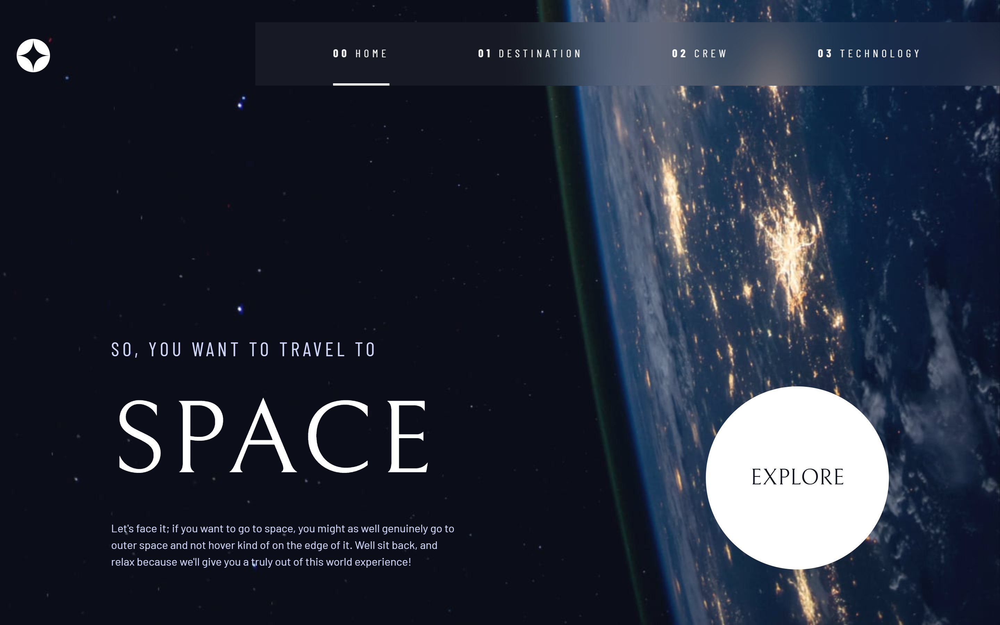
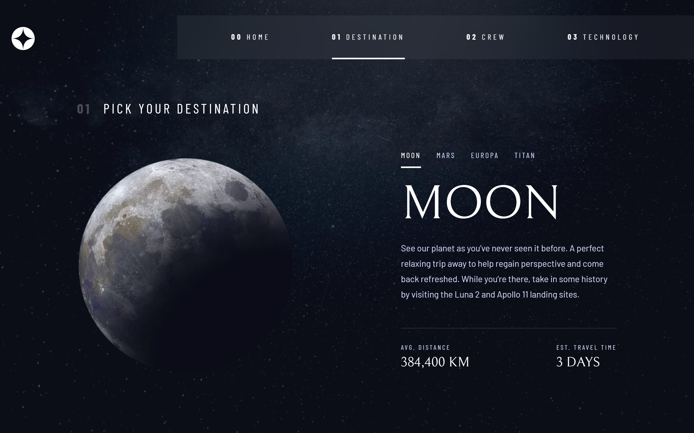
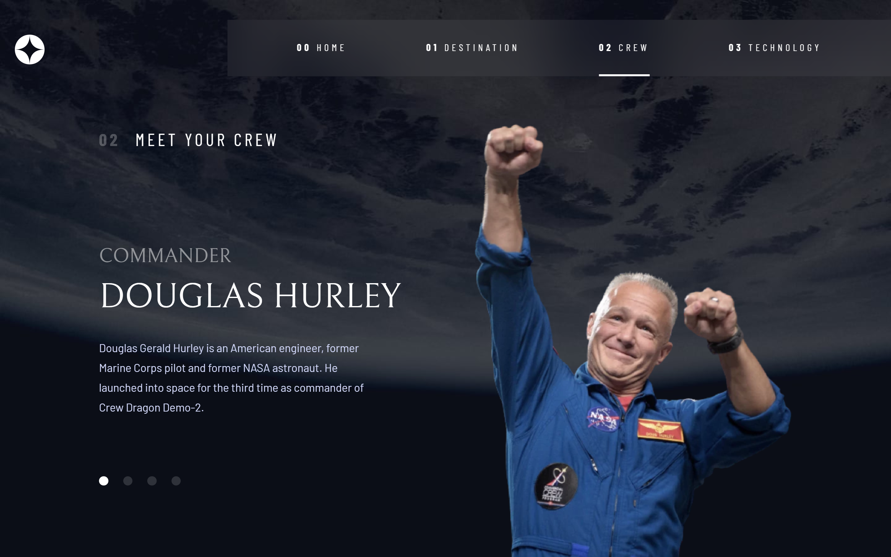
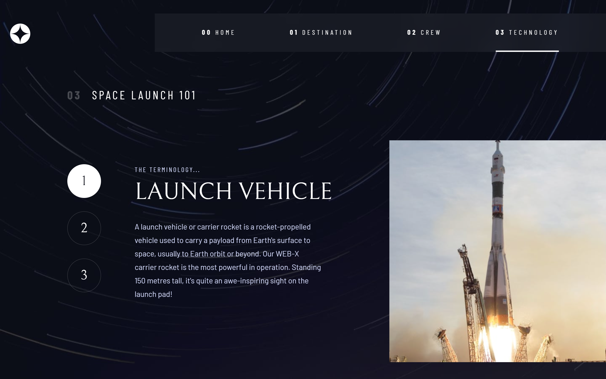
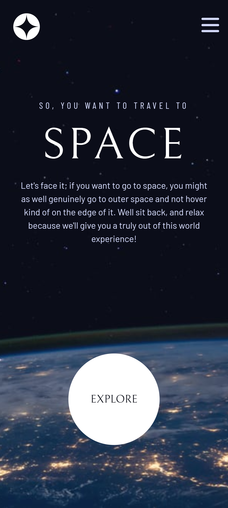
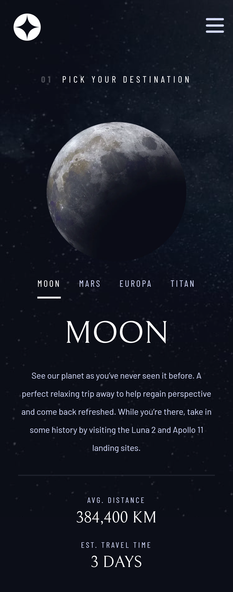
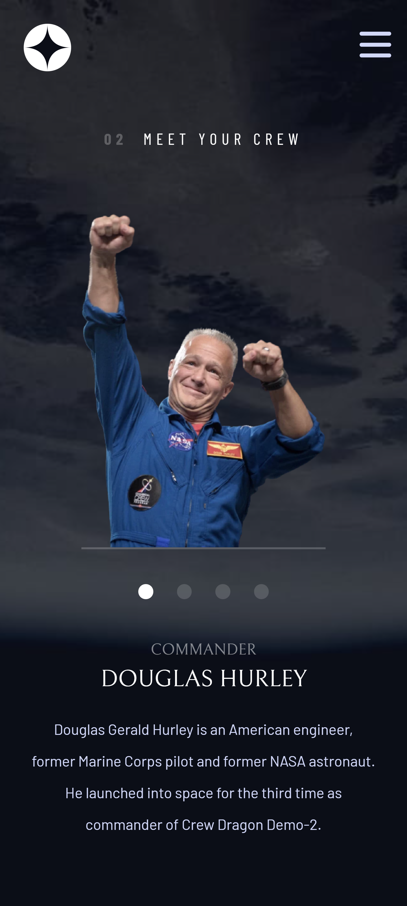
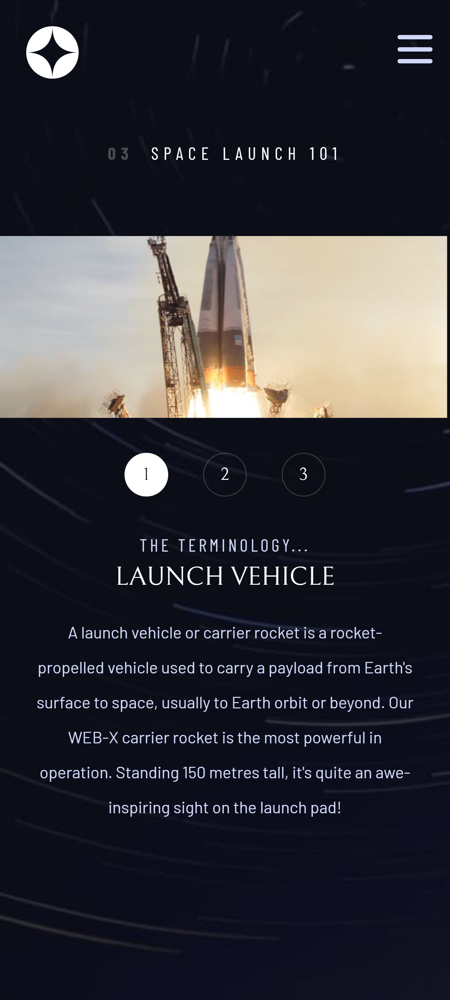
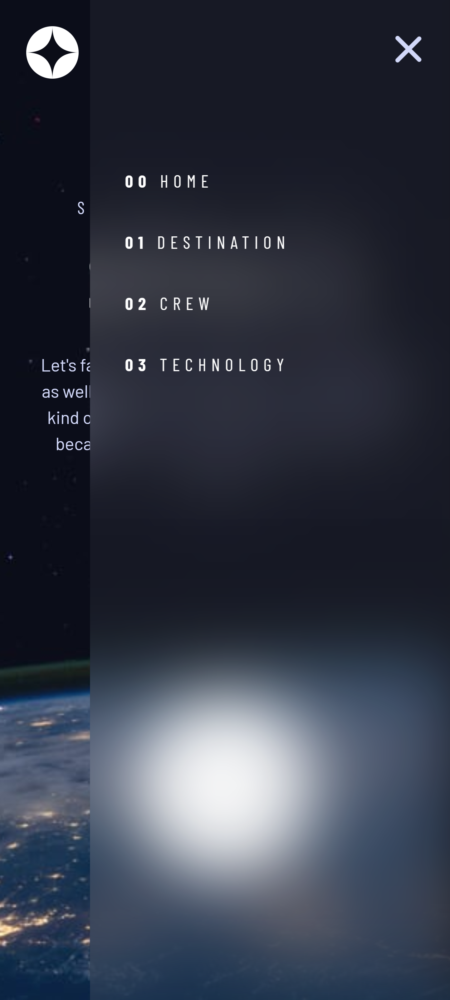

# Frontend Mentor - Space tourism multi-page website Challenge solution

This is a solution to the [Space tourism multi-page website Challenge challenge on Frontend Mentor](https://www.frontendmentor.io/challenges/space-tourism-multipage-website-gRWj1URZ3). Frontend Mentor challenges help you improve your coding skills by building realistic projects.

## Table of contents

- [Frontend Mentor - Space tourism multi-page website Challenge solution](#frontend-mentor---space-tourism-multi-page-website-challenge-solution)
  - [Table of contents](#table-of-contents)
  - [Overview](#overview)
    - [The challenge](#the-challenge)
    - [Screenshot](#screenshot)
    - [Links](#links)
  - [My process](#my-process)
    - [Built with](#built-with)
  - [Author](#author)

## Overview

### The challenge

Users should be able to:

-   View the optimal layout for each of the website's pages depending on their device's screen size
-   See hover states for all interactive elements on the page
-   View each page and be able to toggle between the tabs to see new information

### Screenshot

### Links

-   Solution URL: [GitHub](https://github.com/KaeserOfHonour/Space-Tourism)
-   Live Site URL: [Netlify](https://smug-space-tourism.netlify.app/)

## My process

### Built with

-   Semantic HTML5 markup
-   CSS custom properties
-   Flexbox
-   CSS Grid
-   [SASS](https://sass-lang.com/) - CSS Preprocessor
-   [React](https://reactjs.org/) - JS library

## Author

-   Frontend Mentor - [@KaeserOfHonour](https://www.frontendmentor.io/profile/KaeserOfHonour)
